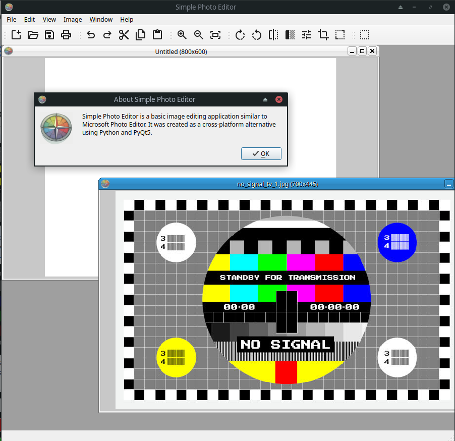

# Simple Photoeditor

Simple Photoeditor is an open-source Python-based multi platform image editing tool inspired by the classic Microsoft Photoeditor. While the original software is no longer supported and has several limitations, it offered a user-friendly and minimalistic interface for document scanning and processing. Simple Photoeditor aims to recreate that experience with modern functionality, allowing users to create, edit, and process images efficiently.



## Features

- **Image Creation and Editing**: Create new images or edit existing ones with a simple, intuitive interface.
- **Multi-Image Composition**: Combine multiple images onto a single canvas for composite designs.
- **Standard Operations**:
  - Resize, crop, and rotate images.
  - Adjust brightness, contrast, and other basic properties.
- **Scanning and Printing**: Scan documents directly into the editor and print images with ease.
- **Minimalistic Design**: Streamlined interface for quick and efficient workflows.

## Requirements

- **Python 3.10 – 3.13** (3.12 recommended). Python 3.14 is not supported yet — the pinned `numpy`/`pillow` wheels are not published for it.
- Linux, Windows or macOS.

## Installation

1. **Clone the Repository**:
   ```bash
   git clone https://github.com/li-zard/Simple-Photoeditor.git
   cd Simple-Photoeditor
   ```

2. **Set Up a Virtual Environment**:

   Linux / macOS:
   ```bash
   python3.12 -m venv venv
   source venv/bin/activate
   ```

   Windows:
   ```bat
   py -3.12 -m venv venv
   venv\Scripts\activate
   ```

3. **Install Dependencies**:
   ```bash
   pip install -r requirements.txt
   ```

4. **Run**:
   ```bash
   python main.py
   ```

> **Linux note — Qt version conflict.** On systems with a system-wide Qt 5 installed
> (e.g. Arch with `qt5-base`), the app may abort with
> `Cannot mix incompatible Qt library (5.15.x) with this library (5.15.y)`.
> Fix: quarantine the conflicting plugin shipped inside the PyQt5 wheel (PDF image
> loading is not used by this app):
>
> ```bash
> mkdir -p venv/_disabled_plugins
> mv venv/lib/python3.*/site-packages/PyQt5/Qt5/plugins/imageformats/libqpdf.so \
>    venv/_disabled_plugins/
> ```
>
> Re-apply after reinstalling `PyQt5-Qt5` or rebuilding the venv. Details and an
> alternative (distro PyQt5 package) in [docs/building.md](docs/building.md).

## Key Dependencies

- **OpenCV-Python-Headless** (`opencv-python-headless==4.11.0.86`): For image processing and manipulation.
- **Pillow** (`pillow==11.1.0`): For advanced image handling and editing.
- **PyQt5** (`PyQt5==5.15.11`): For the graphical user interface.
- **NumPy** (`numpy==2.2.3`): For efficient array operations.
- **PyInstaller** (`pyinstaller==6.12.0`): For packaging the application into an executable.

For a full list of dependencies, see `requirements.txt`.


## Download

Prebuilt binaries are available on the [Releases page](https://github.com/li-zard/Simple-Photoeditor/releases):

- **Windows installer** — `SimplePhotoEditor_Setup_v1.0.exe`: Start-menu shortcut, optional desktop icon, optional "Open with" integration for PNG/JPEG/BMP/GIF/TIFF/GIF (per-user, no admin rights required).
- **Windows portable** — a zip of the `SimplePhotoEditor` folder: unpack anywhere and run `SimplePhotoEditor.exe`, no installation and no traces (settings are stored in the user profile).

> Note on Windows 11 Smart App Control: unsigned builds may be blocked on machines with SAC enabled. See [docs/building.md](docs/building.md) for details.

## Usage

1. Run the application:
   ```bash
   python main.py
   ```

   Optionally open a file directly (a running instance receives it in the same window):
   ```bash
   python main.py photo.png
   ```

2. Use the interface to:
   - Open or scan images.
   - Perform edits (resize, crop, rotate, adjustments, …).
   - Combine multiple images on a canvas (MDI).
   - Save or print your work.

## Building from Source

Full details in [docs/building.md](docs/building.md). Short version:

**Linux** (after `source venv/bin/activate` and `pip install -r requirements-dev.txt`):

```bash
python -m PyInstaller main.py --onedir --windowed --icon=icons/icon.ico \
    --name="SimplePhotoEditor" \
    --add-data "icons:icons" --add-data "config.ini:."
```

> Arch Linux / system-Qt users: if the app aborts with `Cannot mix incompatible Qt library`, see the Troubleshooting section of [docs/building.md](docs/building.md).

**Windows** (after `venv\Scripts\activate` and `pip install -r requirements-dev.txt`):

```bat
build_windows.bat
```

The script runs PyInstaller (onedir) and then Inno Setup (`ISCC.exe`, [Inno Setup 6+](https://jrsoftware.org/isinfo.php) required) to produce `installer\Output\SimplePhotoEditor_Setup_v1.0.exe`. The `dist\SimplePhotoEditor\` folder itself is a portable build — zip it to distribute without installation.

## Contributing

We welcome contributions! To get started:

1. Fork the repository.
2. Create a new branch (`git checkout -b feature/your-feature`).
3. Commit your changes (`git commit -m "Add your feature"`).
4. Push to the branch (`git push origin feature/your-feature`).
5. Open a Pull Request.


## License

This project is licensed under the MIT License. See the [LICENSE](LICENSE) file for details.

## Acknowledgments

- Inspired by the simplicity and functionality of Microsoft Photoeditor.
- Built with the power of Python and open-source libraries.

## Support Project
- Patreon: [patreon.com/li_zard]
