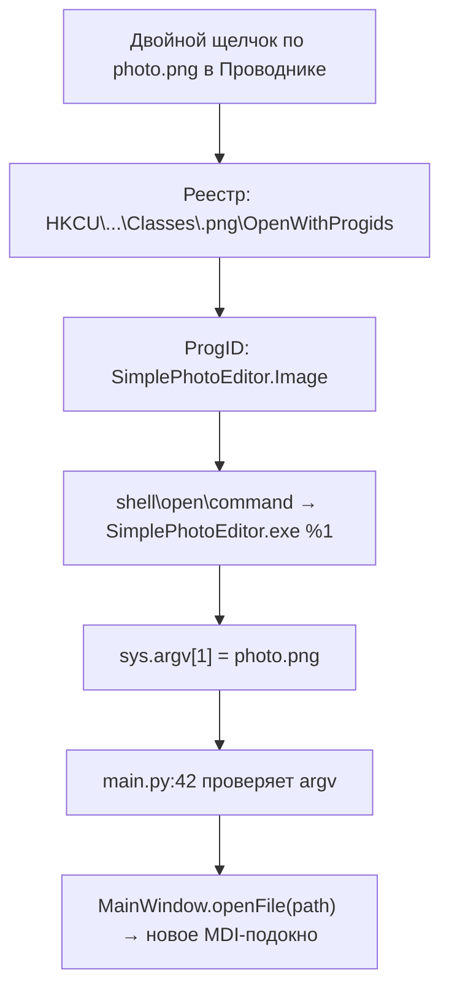

# Roadmap развития Simple Photo Editor

Поэтапный план улучшения проекта: от чистки кода до Windows-инсталлятора на Inno Setup с ассоциациями графических файлов. Каждый этап независим по итогам, но порядок подобран так, чтобы рефакторинг (этапы 1–3) облегчил добавление функций (этап 5) и упаковку (этап 6).

Обозначения усилий: 🟢 — часы, 🟡 — 1–2 дня, 🔴 — 3+ дня.

---

## Этап 1. Чистка кода (quick wins) — 🟢

Цель: убрать мёртвый код и дубликаты, ничего не меняя в поведении. Идеален как первый PR.

- [x] Удалить мусорную функцию уровня модуля `__init__()` в [`editor.py`](../editor.py) — никогда не вызывалась. *(выполнено)*
- [x] Удалить закомментированную старую версию `EditorContainer` (~60 строк) и старую `resizeImage()` в [`editor.py`](../editor.py) — история сохранится в git. *(выполнено)*
- [x] Убрать дубликат определения [`crop_act`](../main_window.py:187) (работал только второй). *(выполнено)*
- [x] Убрать дубликат [`selection_tool_act`](../main_window.py:281) — удалены оба лишних определения (в `__init__` и в `createActions`); осталась единственная версия с `activateSelectionTool`. *(выполнено)*
- [x] Удалить одну из двух реализаций `resource_path()`: осталась [`utils.resource_path()`](../utils.py:17), [`main_window.py`](../main_window.py) импортирует её из [`utils`](../utils.py). *(выполнено)*
- [x] Заменить отладочные `print()` на `logging`:
  - [x] [`main_window.py`](../main_window.py): `openFile()`, `saveFile()`, `saveFileAs()`, `toggleRulers()`, `saveImageToFile()`, `closeEvent()`;
  - [x] [`commands.py`](../commands.py): `GrayscaleCommand.execute()`;
  - [x] [`utils.py`](../utils.py): `load_config()`, `save_config()`.
  Схема: `logging.getLogger("photoeditor.<module>")`, уровень настраивается переменной окружения `PHOTOEDITOR_LOGLEVEL` (по умолчанию `WARNING`), формат — `время уровень [имя] сообщение`. Настройка выполняется в [`main.py`](../main.py).
- [x] Разделить зависимости: `pyinstaller`, `altgraph`, `pyinstaller-hooks-contrib`, `setuptools`, `packaging` перенесены из [`requirements.txt`](../requirements.txt) в новый [`requirements-dev.txt`](../requirements-dev.txt) (включает `-r requirements.txt`). *(выполнено)*

**Критерии приёмки:** приложение запускается и работает как раньше; `python -m compileall .` без ошибок; `grep -rn "print(" *.py` возвращает только осмысленные места (или ничего).

---

## Этап 2. Исправления корректности и UX — 🟢🟡

Цель: устранить найденные при анализе поведенческие проблемы.

- [x] **Не сбрасывать zoom при правках.** Добавлен параметр `setImage(image, keep_view=False)` в [`ImageEditor.setImage()`](../editor.py:58); все команды и `fixMovableItem()` вызывают с `keep_view=True` (zoom и позиция просмотра сохраняются при правках и undo/redo). *(выполнено)*
- [x] **Настоящая гамма.** В [`AdjustmentsCommand.execute()`](../commands.py:118) и [`preview_adjustments()`](../editor.py:462) `ImageEnhance.Brightness(gamma)` заменён на степенную кривую через LUT NumPy: `((px / 255) ** (1 / gamma)) * 255` (одна кривая на все каналы, альфа не трогается). *(выполнено)*
- [x] **Сохранять недавние файлы сразу.** После [`add_recent_file()`](../utils.py:75) в [`MainWindow.openFile()`](../main_window.py:537) вызывается [`save_config()`](../utils.py:64) — MRU-список переживает краш. *(выполнено)*
- [x] **EXIF-ориентация.** [`MainWindow.openFile()`](../main_window.py:493) загружает через новый метод [`load_image_with_exif()`](../main_window.py:545) (`ImageOps.exif_transpose` + фолбэк на `QImage` при сбое) — фото с телефонов больше не открываются боком. *(выполнено)*
- [x] **Качество JPEG при сохранении.** В [`saveImageToFile()`](../main_window.py:668) добавлен параметр `quality`; в [`saveFileAs()`](../main_window.py:598) для `.jpg/.jpeg/.webp` запрашивается качество (1–100, по умолчанию 90) через `QInputDialog.getInt`. *(выполнено)*
- [x] **Debounce предпросмотра.** В [`AdjustmentsDialog`](../widgets.py:287) и [`RotationDialog`](../widgets.py:464) пересчёт откладывается через `QTimer` (singleShot, 80 мс); таймер останавливается при OK/Cancel. *(выполнено)*
- [x] **Цвет заливки при Cut.** [`CutCommand`](../commands.py:256) принимает `fill_color` (по умолчанию белый); [`ImageEditor.cut()`](../editor.py:347) пробрасывает параметр. *(выполнено)*

**Критерии приёмки:** поворот/яркость не сбрасывают масштаб; гамма 2.2 заметно отличается от яркости 2.2; MRU выживает после `kill -9`; телефонные фото открываются прямо.

---

## Этап 3. Архитектурный рефакторинг — 🟡

Цель: устранить дублирование и выровнять контракты перед добавлением функций.

- [x] **Вынести общий пайплайн коррекций.** Создан модуль [`imageops.py`](../imageops.py) с функцией [`apply_adjustments_pipeline()`](../imageops.py:19); на неё переведены [`AdjustmentsCommand.execute()`](../commands.py:63) и [`ImageEditor.preview_adjustments()`](../editor.py:404) (~100 скопированных строк удалено). *(выполнено)*
- [x] **Привести команды к контракту `execute()`.** Мутация перенесена внутрь `execute()` у [`ResizeCommand`](../commands.py:243) (теперь принимает `new_width/new_height/keep_aspect`) и [`FixPasteCommand`](../commands.py:286) (принимает `pasted_items`); [`resizeImage()`](../editor.py:296) и [`fixPastedItems()`](../editor.py:112) создают команду и идут через [`executeCommand()`](../editor.py:90). *(выполнено)*
- [x] **Ограничить память undo.** Реализован вариант 1: общий лимит стека [`UNDO_LIMIT = 20`](../editor.py:83) в [`executeCommand()`](../editor.py:90) — самые старые команды вытесняются. *(выполнено)*
- [x] **Убрать неиспользуемый импорт** `ImageEditor` из [`scene.py`](../scene.py:1) — сцена работает через `self.views()[0]`. *(выполнено)*
- [x] **Конфиг: реализовать или удалить.** Ключи применяются:
  - [x] `theme` → полноценная система тем: модуль [`theme.py`](../theme.py) (палитры, [`init_theme()`](../theme.py:151), [`apply_theme()`](../theme.py:120)), меню **Settings → Theme** (System/Light/Dark) с живым переключением ([`switchTheme()`](../main_window.py:403)) и немедленным сохранением в конфиг; в тёмной теме все иконки инвертируются ([`icon()`](../theme.py:88));
  - [x] `show_rulers` → восстановление состояния линеек при создании подокна ([`CustomMdiSubWindow.__init__`](../widgets.py:124)), состояние сохраняется в [`closeEvent()`](../main_window.py:82);
  - [x] `last_opened_file` → открывается при старте, если нет файла в аргументах командной строки ([`main.py`](../main.py:71)); путь сохраняется в [`closeEvent()`](../main_window.py:82).
  - `default_zoom` оставлен на будущее (в роадмап не входит).
- [x] **High-DPI.** Включены `AA_EnableHighDpiScaling` + `AA_UseHighDpiPixmaps` до создания `QApplication` ([`main.py`](../main.py:27)) — устраняет размытие интерфейса (включая заголовки MDI-подокон) на масштабированных экранах.

**Критерии приёмки:** правки коррекций/resize/фиксации вставки проходят полный цикл execute → undo → redo; память процесса при 20+ правках большого изображения остаётся ограниченной; переключение тем применяется без перезапуска, иконки инвертируются в тёмной теме.

---

## Этап 4. Тесты — 🟡

Цель: зафиксировать поведение команд перед дальнейшими изменениями.

- [ ] Создать `tests/test_commands.py`: синтетический `QImage` (например, градиент 100×100), `QT_QPA_PLATFORM=offscreen` для headless-запуска:
  - [ ] `CropCommand`: execute/undo/redo, сравнение байтов изображения;
  - [ ] `TransformCommand`: поворот 90° меняет W↔H, undo восстанавливает;
  - [ ] `AdjustmentsCommand`: яркость/контраст/гамма/autobalance идемпотентны при redo;
  - [ ] `CutCommand`/`PasteCommand`: состояние буфера и сцены;
  - [ ] `ResizeCommand`/`FixPasteCommand` после этапа 3.
- [ ] Тест утилит: [`add_recent_file()`](../utils.py:71) / [`get_recent_files()`](../utils.py:96) — порядок, дедупликация, лимит 5, фильтр несуществующих.
- [ ] Опционально: CI (GitHub Actions) — `pip install -r requirements.txt && pytest`.

**Критерии приёмки:** `pytest` зелёный; новые команды невозможно добавить без падающего теста на undo/redo.

---

## Этап 5. Новые функции — 🟡🔴

Порядок внутри этапа — по ценности; пункт 5.2 желательно сделать **до** инсталлятора.

- [ ] **5.1. Zoom через Ctrl+колесо** с центром на курсоре: переопределить `wheelEvent()` в [`ImageEditor`](../editor.py:19), при `Qt.ControlModifier` вызывать масштаб вместо прокрутки (якорь уже `AnchorUnderMouse`, см. [`__init__`](../editor.py:36)).
- [ ] **5.2. Одноэкземплярность (предпосылка для ассоциаций файлов).** Сейчас каждый двойной щелчок в Проводнике запускает новый процесс (файл принимается через [`sys.argv[1]`](../main.py:42)):
  - [ ] при старте пытаться подключиться `QLocalSocket` к серверу с именем `"SimplePhotoEditor"`;
  - [ ] при успехе — отправить путь к файлу и завершиться; работающий экземпляр принимает путь и вызывает [`MainWindow.openFile()`](../main_window.py:504);
  - [ ] при неудаче — создать `QLocalServer` и слушать;
  - [ ] обрабатывать крах предыдущего экземпляра (`QLocalServer.ServerError` → `removeServer()` → пересоздать).
- [ ] **5.3. Инструмент перемещения выделения** — тащить прямоугольник целиком (сейчас только 8 маркеров в [`createHandles()`](../scene.py:33)); потребуется флаг `moving_selection` в [`ImageEditorScene.mousePressEvent()`](../scene.py:91).
- [ ] **5.4. i18n-подготовка** — обернуть строки интерфейса в `tr()` (действия в [`createActions()`](../main_window.py:135), диалоги в [`widgets.py`](../widgets.py)), чтобы позже подключить `QTranslator`.

**Критерии приёмки:** Ctrl+колесо плавно зумит под курсором; три файла, открытые из Проводника, оказываются в одном окне приложения.

---

## Этап 6. Упаковка и инсталлятор Inno Setup — 🟡

Цель: `SimplePhotoEditor_Setup_v1.0.exe` с ассоциациями графических файлов.

### 6.1. Перейти на `--onedir`

Для установленного приложения onefile хуже: распаковка во временную папку при каждом старте (+1–3 с). «Единый артефакт» и так даёт инсталлятор.

```bash
pyinstaller main.py --onedir --windowed --icon=icons/icon.ico \
    --name="SimplePhotoEditor" \
    --add-data "icons:icons" --add-data "config.ini:."
```

> На Windows разделитель в `--add-data` — точка с запятой: `--add-data "icons;icons"`.

### 6.2. Проверить ресурсы в замороженном приложении

- [ ] Иконки находят­ся через [`resource_path()`](../main_window.py:933) → `sys._MEIPASS` (после этапа 1 останется одна реализация — [`utils.resource_path()`](../utils.py:14)).
- [ ] Дефолтный `config.ini` подхватывается при первом запуске ([`load_config()`](../utils.py:22)).
- [ ] При проблемах добавить `--hidden-import cv2` (grayscale) и `--hidden-import win32com --hidden-import pythoncom` (сканирование, только Windows).

### 6.3. Создать `installer.iss`

- [ ] Положить в корень проекта `installer/installer.iss` (скрипт ниже).
- [ ] Ярлыки: меню «Пуск» + опционально рабочий стол.
- [ ] Задача `fileassoc` — ассоциации файлов.
- [ ] Регистрация через `HKCU` + `OpenWithProgids` — ненавязчивый способ: приложение появляется в меню Проводника «Открыть с помощью → Выбрать другое приложение», пользователь сам решает, назначать ли его по умолчанию. Прямая запись в `HKCR` требует повышения прав и считается некорректной практикой.
- [ ] `uninsdeletekey`/`uninsdeletevalue` — полная очистка при деинсталляции.

```ini
[Setup]
AppName=Simple Photo Editor
AppVersion=1.0
AppPublisher=Li_Zard
DefaultDirName={autopf}\Simple Photo Editor
DefaultGroupName=Simple Photo Editor
OutputBaseFilename=SimplePhotoEditor_Setup_v1.0
SetupIconFile=icons\icon.ico
Compression=lzma2
SolidCompression=yes

[Files]
Source: "dist\SimplePhotoEditor\*"; DestDir: "{app}"; Flags: recursesubdirs
Source: "icons\icon.ico"; DestDir: "{app}"; Flags: ignoreversion

[Tasks]
Name: "desktopicon"; Description: "Create a &desktop icon"; GroupDescription: "Additional icons:"
Name: "fileassoc"; Description: "Associate image files"; GroupDescription: "File associations:"; Flags: checkedonce

[Icons]
Name: "{group}\Simple Photo Editor"; Filename: "{app}\SimplePhotoEditor.exe"
Name: "{commondesktop}\Simple Photo Editor"; Filename: "{app}\SimplePhotoEditor.exe"; Tasks: desktopicon

[Registry]
; --- ProgID ---
Root: HKCU; Subkey: "Software\Classes\SimplePhotoEditor.Image"; ValueType: string; ValueData: "Simple Photo Editor Image"; Flags: uninsdeletekey; Tasks: fileassoc
Root: HKCU; Subkey: "Software\Classes\SimplePhotoEditor.Image\DefaultIcon"; ValueType: string; ValueData: "{app}\icon.ico"; Tasks: fileassoc
Root: HKCU; Subkey: "Software\Classes\SimplePhotoEditor.Image\shell\open\command"; ValueType: string; ValueData: """{app}\SimplePhotoEditor.exe"" ""%1"""; Tasks: fileassoc

; --- Расширения: добавить в "Открыть с помощью" ---
#define ExtList ".png", ".jpg", ".jpeg", ".bmp", ".gif", ".tiff", ".tif"
#sub AssocEntry
Root: HKCU; Subkey: "Software\Classes\{#Ext}\OpenWithProgids"; ValueType: string; ValueName: "SimplePhotoEditor.Image"; ValueData: ""; Flags: uninsdeletevalue; Tasks: fileassoc
#endsub
#for {Ext in ["{#ExtList}"]} AssocEntry
```

### 6.4. Сборочная цепочка

- [ ] Установить [Inno Setup](https://jrsoftware.org/isinfo.php) (бесплатен); компилятор — `ISCC.exe`.
- [ ] Скрипт сборки `build_windows.bat` (или задача в `Makefile`):

```bat
pyinstaller main.py --onedir --windowed --icon=icons\icon.ico ^
    --name="SimplePhotoEditor" ^
    --add-data "icons;icons" --add-data "config.ini;."
ISCC installer\installer.iss
```

- [ ] Артефакт: `installer\Output\SimplePhotoEditor_Setup_v1.0.exe` (путь задаёт `OutputDir`, по умолчанию `Output\` рядом с `.iss`).

### 6.5. Приёмочные проверки

- [ ] Установка → ярлык → запуск → открытие PNG/JPEG/BMP.
- [ ] В Проводнике: «Открыть с помощью» содержит Simple Photo Editor; после выбора — файл открывается в уже запущенном экземпляре (требуется 5.2).
- [ ] Деинсталляция удаляет программу **и** записи ассоциаций; при «Открыть с помощью» не остаётся битых пунктов.
- [ ] Повторная установка поверх существующей (обновление) проходит без дублей в реестре.
- [ ] Первый запуск от нового пользователя Windows: создаётся пользовательский `config.ini` (см. [Configuration](configuration.md)).

---

## Сводная таблица

| Этап | Тема | Усилие | Зависимости |
|------|------|--------|-------------|
| 1 | Чистка кода | 🟢 | — |
| 2 | Корректность/UX | 🟢🟡 | — |
| 3 | Архитектура | 🟡 | желательно после 1 |
| 4 | Тесты | 🟡 | желательно после 3 |
| 5 | Функции (zoom, single-instance, …) | 🟡🔴 | 5.2 до этапа 6 |
| 6 | Inno Setup + ассоциации | 🟡 | 5.2 (одноэкземплярность) |

## Как работает ассоциация (напоминание)


